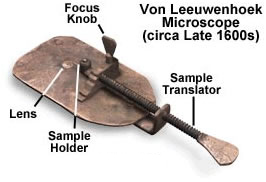
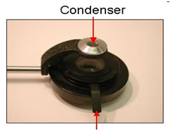
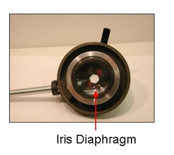
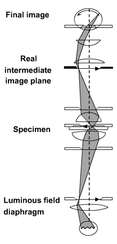
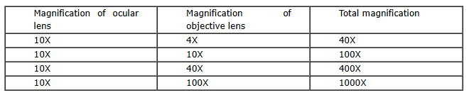
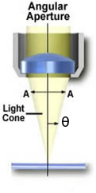
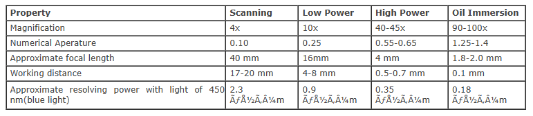

### Microscope
 
Microscope is an optical instrument that uses lens or combination of lens to produce  magnified images that are too small to seen by unaided eye. Microscope provides the enlarged view that helps in examining and analyzing the image. Microscope can be separated into optical theory microscopes (Light microscope), electron microscopes (eg.TEM, SEM) and scanning probe microscopes. (eg.AFM, PSTM).

Optical microscopes function on the basis of   optical theory of lenses by which it can magnifies the image obtained by the movement of a wave through the sample. The waves used  in optical microscopes are electromagnetic and that in electron microscopes are  electron beams. Light microscopes can be classified into Bright field microscope, Phase contrast microscope, Dark field microscope and Fluorescence microscope.

 
&nbsp;

### Light Microscopy
 

Light microscope uses the properties of light to produce an enlarged image. It is the simplest type of microscope. Based on the simplicity of the microscope it may be categorized into:

 
A. Simple microscope.

B. Compound microscope.

 

#### A. Simple microscope
 

It is  uses only a single lens, e.g.: hand lens. Most of these are double convex or planoconvex lens. The developments of advanced techniques for grinding and shaping lenses allowed professionals such as Hans Janssen and Anton van Leeuwenhoek to develop simple microscopes which advanced the study of biology significantly.

&nbsp;

 

#### B. Compound microscope
 

In the compound microscope used two lenses or lens systems. One of the  lens system formed an enlarged image of the object and the second lens system magnifies the image formed by the first. The modern compound microscope consists of two lens system, the objective and the ocular or eye piece. The first magnified image obtained with objective lens, is again magnified by the eye piece to give a virtual inverted image. The total magnification  the  product of the magnifications of  two lens systems.

&nbsp;

### Parts of a Microscope
 

It consists of mainly three parts:

1. Mechanical part - base, c-shaped arm and stage.

2. Magnifying part - objective lens and ocular lens.

3. Illuminating part - sub stage condenser, iris diaphragm, light source.
 

&nbsp;

#### Mechanical part
##### Base: 
It helps in holding the various parts of microscope. It also contains the light source.

##### C-shaped arm: 
It is used for holding the microscope. And which is connected the eyepiece to the objective lens.

##### Mechanical stage: 
It is a rigid platform on which specimen to be viewed is placed. It has an aperture at the centre to permit light to reach the object from the bottom. The object on the slide can be moved either sideways or forward and backward with the help of the positioning knobs.
 

&nbsp;

#### Magnifying part
 
1. Eyepiece (Ocular lens):

It is the lens where the final image of the object is viewed. Usually; these lenses have a magnification of either 10X or 15X.

&nbsp;

2. Objective lens:

There are three types of objective lens: 4X (scanning objective)

1. 10X (Low power objective lens).

2. 40X (High power objective lens).

3. 100X (Oil immersion objective lens).

 

Each objective lens is represented by a particular colour. Here we represents 4X with red band, 10X with yellow, 40X with blue and 100X with white. These objective lenses are fitted on to the revolving nose piece. The working distance of an objective is defined as the distance between the front surface of the lens and the cover glass surface  or the specimen when it is in sharp focus.

&nbsp;

#### Illuminating part
 
##### Sub stage condenser:

It is seen below the stage and made up of a system of convex lenses which focus light from illuminating sources and is used to condense light towards the object. Lowering the condenser diminishes illumination whereas raising the condenser increases the illumination.

&nbsp;

 
##### Iris diaphragm:

It is seen immediately below the condenser and operated by small lenses which protrude to one side. Opening and closing of iris diaphragm controls the light reaching the object.

&nbsp;

##### Light source:

Light source is situated at the base of the microscope. It is controlled by an ON /OFF switch and a lamp rheostat. Tungsten-halogen lamps are highly reliable light source used in the light microscope. It generates a continuous distribution of light across the visible spectrum.

 

&nbsp;

### Adjustments Knobs in the Microscope
 
#### 1. Coarse Adjustment Knob:

objective lenses can be moved towards or away from the specimen by using this coarse adjustment knob

 

#### 2. Fine Adjustment Knob:

It  is used to fine tune the focus on the specimen and also used to focus on various parts of the specimen. commonly one uses the coarse focus first to get close and moves to the fine focus knob for fine tuning.

&nbsp;

### Image Formation
 

The  direct or undeviated light from a specimen is projected by the objective and it spreads evenly across the entire image plane at the diaphragm of the eyepiece. The light diffracted by the specimen is come  to focus at different  localized sites on the same image plane, and  the diffracted light causes destructive interference. One of the consequences is the reduction in light intensity resulting the greater or lesser  dark areas. The  patterns of light and dark that  are  recognized as an image of the specimen. Because our eyes are very sensitive to variations in brightness, and  then the  image becomes  more or less faithful reconstitution of the original specimen.

 

 The objective lens at first formed  a real and  inverted magnified image. And then the  eye piece further magnifies the same image to  virtual magnified image.

 

&nbsp;

 

 

#### Focusing On Microscopic Objects
 

##### Start with Clean Lenses:

It is important that microscope lenses be very clean. Before viewing through a microscope, use lens paper to gently clean the lenses.

 

##### Begin at Low Power Magnification:

 

Always begin by viewing the object through a low power lens. Depending on how small the object is, start with the scanning or low-power objective.

 

Using low-power objective lens, get the target object centered in the field-of-view and focus as much as possible, first by using the coarse focus and then fine-tuning the clarity of the image with the fine focus.

 

Once the object is in focus, switch to the next higher objective power. Do not change the focus or manipulate the focus knobs in any way while changing objectives.

 

##### Adjustments for oil immersion objective:

 

Without changing the adjustment of high power, turn to oil immersion objective. One drop of oil is  added  into on the slide. The nose piece is turned such that the oil immersion objective touches on the drop of oil. Open the iris diaphragm completely. Use only fine adjustments for focusing.

 

##### The Importance of Par focal:

 

A set of objectives on a microscope are said to be par focal if the viewer can change from one to another and still have the specimen nearly in focus. This is a very convenient feature, because as the magnification increases, even small manipulations of the focus knob can take a specimen far out of focus.

 

After changing to a higher objective (such as high-dry or oil-immersion) the viewer needs only manipulate the fine focus knob. Never manipulate the coarse focus at oil immersion. Manipulating the coarse focus at high power can smash the lens into the slide, potentially damaging the scope and the specimen.

 

### Key Points
 

#### Magnification:

 

Magnification is  defined as the degree of enlargement of an object provided by the microscope. Magnification of a microscope is the product of individual magnifying ability of ocular lens and objective lens.

&nbsp;

#### Resolving power:

It is defined as an ability to distinguish between two particles situated very close.

 
#### Numerical aperture:

It is defined as the property of lens that decides the quantity of light that can enter. The angle of the cone of light entering an objective is known as theta

NA=nsinθ ; NA=numerical aperture

n=refractive index of the imaging medium between the front lens of the objective and the specimen cover glass, a value that ranges from 1.00 for air to 1.51 for specialized immersion oils.

θ= one-half of the angular aperture (A)

&nbsp;

 
#### Limit of resolution:

It is defined as the shortest distance between two objects when they can be distinguished as two separate entities.

Resolution is a subjective value in microscopy because at high magnification, an image may appear not very sharp but still it can be resolved to the maximum ability of the objective. Numerical aperture is defined as  the resolving power of an objective, but the entire  resolution of a microscope system is also depends on the numerical aperture of the sub stage condenser. For getting a  better  resolution, higher the numerical aperture of the total system.

Abbe equation is used to calculate the limit set on the resolution of light microscope.   The oil immersion objective gives the maximum theoretical resolving power of  the microscope , the numerical aperture of 1.25 and blue-green light is around  0.2μm.

The  bright-field microscope can distinguish between two dots approximately  0.2 μm apart (the same size as a very small bacterium).

#### Properties of Microscopic Objective Lens
 

&nbsp;

#### Care of the Microscope
 
Microscope is a delicate instrument which should be properly used. Fungal growth on the lens or scratches caused by dust can ruin the lenses. So microscope should be handled carefully.

 
. Carry the microscope by holding the C-shaped arm with one hand and other hand under the base. Never swing the microscope while carrying.

. Never allow direct light to fall on the microscope. Cover the microscope with a plastic cover when not in use.

. While using oil immersion objective, do not adjust the coarse screw.

. Oil immersion objective should be cleaned after use by wiping with soft cotton cloth or lens paper.

. Dry objective should never come in contact with oil.

. At the end of every experiment, clean the lenses with lens paper.

. The scanning objective or the 4x objective should be locked in place in the revolving nose piece, the stage should be centered and objectives should be rolled up away from the stage, when the microscope is replaced after use.

. When the microscope is replaced in the cabin .the microscope's arm/pillar must face the opening of the cabin.
 